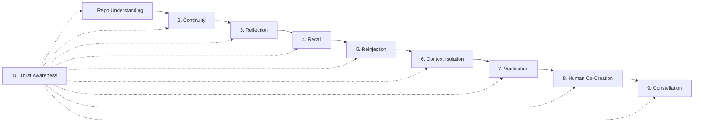

# SRT1 Authority Graph

## Purpose

This document recovers dependency order, authority interactions, circular dependency warnings, and missing authority relationships. It is an architectural graph, not a package map.

## Canonical Dependency Graph

## Dependency Table

| Authority | Depends on | Provides to next authority |
| --- | --- | --- |
| Repo Understanding | Local files, parsers, hashing, manifest rules | Repo facts, symbols, dependencies, manifest, freshness evidence |
| Continuity | Repo Understanding | Seed/build state, partial completion state, lifecycle checkpoints |
| Reflection | Continuity, Repo Understanding | Drift findings, coherence warnings, doctrine conflicts |
| Recall | Reflection, Continuity | Relevant prior state, freshness state, context eligibility |
| Reinjection | Recall, Reflection, Continuity | Assistant-facing context, warnings, bounded instructions |
| Context Isolation | Reinjection, Repo Understanding, Continuity | Workcell boundaries, allowed/forbidden paths, scope limits |
| Verification | Context Isolation, Continuity, Repo Understanding | Verification result, stitch readiness, re-index trigger |
| Human Co-Creation | Verification, Reinjection, Continuity | Approval/rejection/edit decisions, accepted work state |
| Constellation | Human Co-Creation, Context Isolation, Repo Understanding | Federated engine awareness, no-contamination coordination |
| Trust Awareness | Cross-cutting | Integrity, lineage, verification, approval, freshness, and identity metadata |

## Authority Interactions

### Repo Understanding to Continuity

Continuity must not invent state without current repo facts. A seed or build plan should reference the manifest version or freshness state it was based on.

### Continuity to Reflection

Reflection evaluates whether the current repo and assistant behavior still match the active seed/build state. Reflection is detective-only and does not mutate code.

### Reflection to Recall

Recall uses reflection findings to decide what historical state is relevant, stale, degraded, or unsafe to inject.

### Recall to Reinjection

Reinjection takes a selected recall slice and turns it into assistant-facing context. Standing instruction files should stay compact; generated symbol maps belong in manifests/context outputs.

### Reinjection to Context Isolation

Context Isolation uses reinjected task scope and manifest evidence to define the local workcell. The assistant should receive boundaries before it proposes or performs work.

### Context Isolation to Verification

Verification cannot judge safety without the workcell. Diffs and proposals must be checked against allowed reads/writes and forbidden paths.

### Verification to Human Co-Creation

The human receives verification evidence and decides whether to approve, reject, edit direction, accept work, or return work for revision.

### Human Co-Creation to Constellation

Constellation may coordinate independent engines only when human-approved boundaries permit cross-module awareness. It must not merge contexts by default.

### Trust Awareness Cross-Cuts All Authorities

Trust Awareness labels artifacts and transitions:

| Authority | Trust state carried |
| --- | --- |
| Repo Understanding | manifest hash, parser coverage, freshness |
| Continuity | seed lineage, state transition provenance |
| Reflection | finding confidence, doctrine source |
| Recall | fresh/stale/degraded/unknown |
| Reinjection | context provenance, injection time |
| Context Isolation | boundary derivation source, forbidden-path state |
| Verification | verified/unverified, evidence present/missing |
| Human Co-Creation | approval present/missing, accepted/rejected |
| Constellation | engine identity, sharing permission |

## Circular Dependency Warnings

1. Reinjection must not overwrite Repo Understanding. Generated context is downstream of manifest facts, not a substitute for indexing.
2. Reflection must not mutate Continuity directly. It can recommend state changes, but Continuity owns lifecycle state.
3. Human Co-Creation must not bypass Verification. Approval should rely on verification evidence when code changes are involved.
4. PWA/dashboard must not bypass Context Isolation. Human commands still need workcell boundaries.
5. Constellation must not feed unapproved cross-repo context back into Recall or Reinjection.
6. Trust Awareness must not depend on private signing to function. Core trust metadata must operate unsigned/unverified/fail-closed when private authority is absent.
7. Verification must not become merge authority or private audit signing.

## Missing Authority Relationships

| Missing relationship | Why it matters |
| --- | --- |
| Manifest version to seed state | Seeds need to know which repo facts they were planted against. |
| Reflection finding to reinjection packet | Drift warnings need a controlled path into assistant context. |
| Recall freshness to context serving | Stale historical docs must not enter default context. |
| Workcell boundary to diff verification | Verification must know which paths are allowed. |
| Human approval to continuity transition | State transitions need explicit human decision provenance. |
| Constellation sharing rule to context bundle | Cross-module awareness must not become context bleed. |
| Trust metadata to every artifact | Signed/unsigned, verified/unverified, and lineage state need a common vocabulary. |

## Authority Conflicts Discovered

1. Current implementation candidates are arranged by modules and packages, while the recovered organism is arranged by authorities.
2. Engine-like files may combine repo understanding, serving, signing hooks, seed lifecycle, dashboard, and context generation in one place.
3. PWA surfaces risk being described as controllers when their recovered role is cockpit/observability/review.
4. Private memory, security, signing, audit, and SION concepts appear in historical docs and generated maps, but are not public Core authority.
5. FileCell, manifest derivation, verification, and operational registry remain valid Core/Pro candidates only after private coupling is removed or abstracted.
