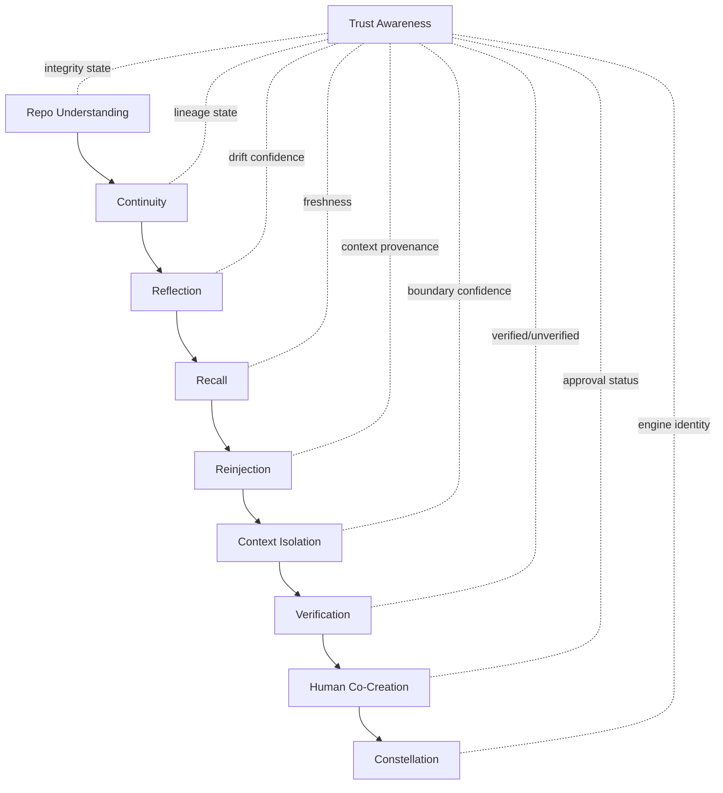

# SRT1 Organ Diagram

## Purpose

This document recovers SRT-1 as an organism of authorities, not as a list of folders. Current files are evidence. Modules are implementations. Authorities own runtime responsibilities.

SRT-1 Core is a repo-continuity and alignment partner for AI coding assistants. It helps the assistant understand the repo, preserve continuity, reflect on drift, recall relevant state, reinject alignment, isolate context, verify work, keep the human in the loop, coordinate constellations, and understand trust state without shipping private trust implementation.

## Organ Model

## Authorities

### 1. Repo Understanding

- Purpose: Build factual knowledge of the local repository.
- Inputs: files, source text, file metadata, language parsers, ignore rules, existing manifests.
- Outputs: file index, hashes, AST/symbol map, dependency map, repo manifest, freshness evidence.
- Dependencies: none at organism root; it is the first authority.
- Runtime responsibilities: scan files, parse supported languages, hash files, detect symbols, produce manifest evidence, trigger re-index after accepted changes.
- Current implementation candidates: `srt1_code_indexer/indexer.py`, `srt1_code_indexer/engine.py`, `srt1_code_indexer/language_parsers.py`, `srt1_code_indexer/srt.py`, `.srt1` generated state.
- Missing implementation candidates: stable manifest schema, parser coverage map, explicit dependency map artifact, generated manifest freshness classification.
- Known authority conflicts: engine code may mix repo understanding with serving, auth, signing hooks, seed state, and dashboard concerns.

### 2. Continuity

- Purpose: Preserve seed and build-plan state across assistant sessions and partial work.
- Inputs: repo manifest, planted seed, active task, blueprint/build plan, prior state, human decisions, verification result.
- Outputs: active/pending/completed/terminated seed state, partial completion state, build-plan state, continuity checkpoint.
- Dependencies: Repo Understanding.
- Runtime responsibilities: create seed, track lifecycle, track partial completion, record plan status, update after verification, prevent stale tasks from overriding current state.
- Current implementation candidates: `srt1_platform/seed_queue.py`, `srt1_platform/tracing_system.py`, `srt1_pro/seed_templates.py`, canonical docs such as `SRT1_CURRENT_STATE.md` and `SRT1_DECISIONS.md`.
- Missing implementation candidates: canonical seed-state contract, build-plan state machine, partial completion ledger separated from private audit implementation.
- Known authority conflicts: seed logic may be treated as task execution rather than continuity; private seed graph or memory concepts must not leak into public Core implementation.

### 3. Reflection

- Purpose: Observe coherence, drift, doctrine conflicts, and architectural risk.
- Inputs: continuity state, repo manifest, context history, doctrine docs, traces, diffs, assistant actions.
- Outputs: drift warnings, coherence checkpoints, doctrine findings, consistency audit findings, reinjection candidates.
- Dependencies: Continuity, Repo Understanding.
- Runtime responsibilities: compare intended direction with actual repo state, detect duplicate systems, detect architectural drift, issue warnings without autonomous remediation.
- Current implementation candidates: `srt1_code_indexer/srt.py`, `srt1_platform/tracing_system.py`, `srt1_platform/doctrine_scanner.py`, `srt1_platform/consistency_auditor.py`, `srt1_platform/governance_monitor.py`.
- Missing implementation candidates: detective-only consistency report contract, drift severity vocabulary, reflection-to-reinjection handoff.
- Known authority conflicts: self-heal language and remediation code paths can blur reflection into autonomous mutation.

### 4. Recall

- Purpose: Retrieve relevant prior state without flooding the assistant with stale history.
- Inputs: continuity docs, manifests, prior checkpoints, completed phase summaries, historical walkthroughs on demand.
- Outputs: relevant memory slice, freshness state, context eligibility decision.
- Dependencies: Reflection, Continuity, Repo Understanding.
- Runtime responsibilities: decide what prior state is current, stale, degraded, or unknown; serve concise history; keep archival evidence out of default context.
- Current implementation candidates: `SRT1_CURRENT_STATE.md`, `SRT1_DECISIONS.md`, `SRT1_CONTEXT_INDEX.md`, `SRT1_FRONTIER.md`, context bundling code, recovery docs.
- Missing implementation candidates: recall index, freshness evaluator, historical evidence retrieval policy as executable metadata.
- Known authority conflicts: SCIA memory implementation is private and must not be treated as public Core recall implementation.

### 5. Reinjection

- Purpose: Reinsert approved alignment context into assistant-facing surfaces.
- Inputs: recall slice, reflection findings, manifest, seed/build state, context isolation policy.
- Outputs: AGENTS/CLAUDE/Cursor instructions, MCP responses, local API context, bounded context bundles.
- Dependencies: Recall, Reflection, Continuity, Repo Understanding.
- Runtime responsibilities: serve current context, avoid stale walkthrough injection, inject drift warnings, update assistant instructions only through approved channels.
- Current implementation candidates: `AGENTS.md`, `CLAUDE.md`, `.cursorrules`, `srt1_platform/mcp_server.py`, `srt1_pro/context_bundler.py`, reinjection logic referenced by engine traces.
- Missing implementation candidates: canonical reinjection packet schema, context-tier resolver, stale-context prevention guard.
- Known authority conflicts: standing instruction files previously carried generated repo maps and private references; this belongs in manifests/context outputs instead.

### 6. Context Isolation

- Purpose: Keep the assistant and runtime inside the correct local workcell.
- Inputs: manifest, seed scope, allowed paths, forbidden paths, repo root, dependency map, human-approved scope.
- Outputs: workcell boundary, allowed read/write policy, forbidden path list, scope violation findings.
- Dependencies: Reinjection, Repo Understanding, Continuity.
- Runtime responsibilities: derive local workcell boundaries, prevent cross-project bleed, prevent out-of-scope reads/writes, block private paths from public Core actions.
- Current implementation candidates: `srt1_platform/filecell.py`, `srt1_platform/manifest_deriver.py`, `srt1_platform/execution_lease.py`, `.gitignore`, recovery inventory.
- Missing implementation candidates: public workcell contract, fail-closed path policy, manifest-derived containment proof.
- Known authority conflicts: FileCell and manifest derivation are Core/Pro candidates only if decoupled from private signing, SION, private audit ledger, and Enterprise runtime.

### 7. Verification

- Purpose: Verify proposed and completed changes against repo facts, scope, continuity, and trust metadata.
- Inputs: change proposal, diff, workcell boundary, manifest, seed/build state, post-execution evidence, trust metadata.
- Outputs: verification result, stitch-readiness state, accepted/rejected evidence, re-index trigger.
- Dependencies: Context Isolation, Reinjection, Reflection, Continuity, Repo Understanding.
- Runtime responsibilities: check diffs, confirm allowed files, compare changes to seed intent, detect incomplete work, request re-index after accepted changes.
- Current implementation candidates: `srt1_platform/verification.py`, `srt1_platform/change_proposal.py`, `srt1-contracts/contracts/post_execution_verification_contract.md`, `srt1-contracts/contracts/change_proposal_contract.md`.
- Missing implementation candidates: public verification contract, post-execution evidence schema, stitch interface.
- Known authority conflicts: verification must not become private audit signing or autonomous merge authority.

### 8. Human Co-Creation

- Purpose: Keep the human as review, approval, rejection, and direction authority.
- Inputs: seed, blueprint, drift warning, verification result, runtime status, trust state, scope-change request.
- Outputs: approved/rejected/edited direction, accepted work, returned work, scope decision, continuity update.
- Dependencies: Verification, Context Isolation, Reinjection, Continuity, Trust Awareness.
- Runtime responsibilities: plant seeds, review blueprints, edit direction, approve/reject, request scope change, respond to drift, monitor status, accept completed work, return work for revision.
- Current implementation candidates: `developer-pwa/`, `srt1_platform/pwa/`, dashboard routes, local API surfaces.
- Missing implementation candidates: approval event contract, human decision state machine, direct-controller prohibition enforcement.
- Known authority conflicts: PWA must not directly mutate code, bypass workcells, bypass verification, bypass approval gates, or bypass continuity tracking.

### 9. Constellation

- Purpose: Coordinate independent SRT-1 engines without contaminating context by default.
- Inputs: local engine registry, per-engine ports, workspace folders, manifest summaries, explicit sharing rules.
- Outputs: constellation map, per-engine identity, cross-module awareness, no-contamination boundary.
- Dependencies: Human Co-Creation, Verification, Context Isolation, Repo Understanding.
- Runtime responsibilities: discover engines, map ports/folders, query summaries, coordinate cross-module awareness, preserve independent context boundaries.
- Current implementation candidates: `srt1_pro/workspace_connector.py`, `srt1_platform/operational_registry.py`, dashboard constellation pages.
- Missing implementation candidates: federated engine identity contract, allowed-sharing policy, cross-module dependency summary schema.
- Known authority conflicts: constellation must not become a shared global memory or re-index other repos by default.

### 10. Trust Awareness

- Purpose: Track integrity vocabulary and trust state without shipping private signing implementation.
- Inputs: manifest hash, lineage metadata, verification result, approval state, execution history metadata, optional external signature status.
- Outputs: signed/unsigned, verified/unverified, lineage present/missing, fresh/stale/degraded/unknown, trusted/untrusted status metadata.
- Dependencies: cross-cutting across every authority.
- Runtime responsibilities: label trust state, preserve lineage, expose missing verification, fail closed when private authority is unavailable.
- Current implementation candidates: docs, manifest metadata, verification metadata, tracing metadata, optional public contracts.
- Missing implementation candidates: public trust metadata schema, fail-closed external signing adapter contract.
- Known authority conflicts: Core must not contain private Seed Signature authority, private keys, private audit chain, SCIA memory implementation, SCIA security implementation, SION internals, or Enterprise backend implementation.

## Organ Interactions

1. Repo Understanding supplies facts.
2. Continuity turns facts and intent into living state.
3. Reflection evaluates whether state, repo facts, and behavior still cohere.
4. Recall retrieves only the relevant prior state.
5. Reinjection gives the assistant bounded current context.
6. Context Isolation constrains the workcell.
7. Verification checks proposals and completed work.
8. Human Co-Creation approves, edits, rejects, accepts, or returns work.
9. Constellation coordinates multiple independent workcells only when allowed.
10. Trust Awareness labels integrity and lineage throughout the organism.
