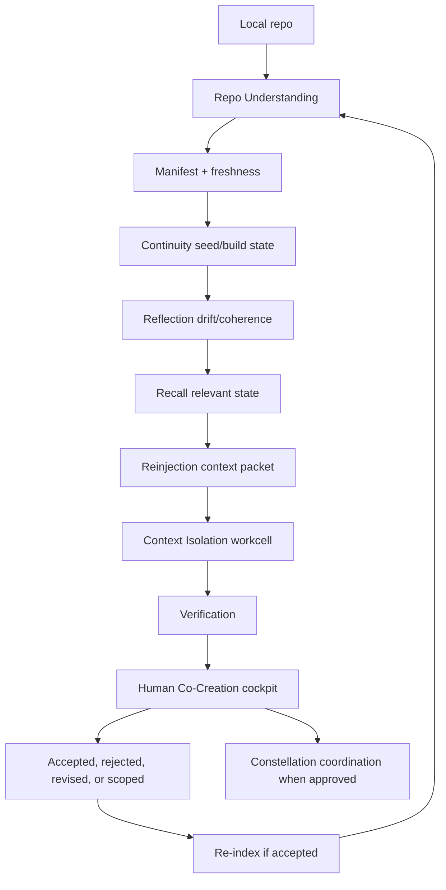

# SRT1 Recovery Architecture v1

## Purpose

This document states the recovered architecture of SRT-1 Core. It is not a description of the current implementation. It is the organism architecture the implementation must be measured against.

## Recovered Architecture

SRT-1 Core is a local repo-continuity and alignment partner for AI coding assistants.

Its architecture is authority-first:

1. Repo Understanding
2. Continuity
3. Reflection
4. Recall
5. Reinjection
6. Context Isolation
7. Verification
8. Human Co-Creation
9. Constellation
10. Trust Awareness

The organism begins with repo facts and ends with coordinated, human-approved, trust-aware continuity across one or more independent workcells.

## Runtime Architecture

## Authority Architecture

| Authority | Owns | Does not own |
| --- | --- | --- |
| Repo Understanding | repo facts, manifest, hashes, symbols, dependencies | seed lifecycle, human approval, private signing |
| Continuity | seed/build state, partial completion, checkpoints | AST parsing, direct code mutation |
| Reflection | drift/coherence/doctrine findings | auto-remediation, merge, code mutation |
| Recall | relevant prior state and freshness | private SCIA memory implementation |
| Reinjection | bounded assistant-facing context | generated full repo maps inside standing instructions |
| Context Isolation | workcell boundaries and forbidden paths | Enterprise-only runtime enforcement |
| Verification | proposal/diff/evidence checking | private audit chain, merge authority |
| Human Co-Creation | review, approve, reject, edit, accept, return | bypassing verification or workcell boundaries |
| Constellation | federated independent engine awareness | shared global context by default |
| Trust Awareness | trust metadata vocabulary and fail-closed state | private Seed Signature authority, private keys |

## Current Implementation Mapping

Current files are candidates, not final architecture.

| Authority | Current implementation candidates |
| --- | --- |
| Repo Understanding | `srt1_code_indexer/indexer.py`, `srt1_code_indexer/engine.py`, `srt1_code_indexer/language_parsers.py`, `srt1_code_indexer/srt.py` |
| Continuity | `srt1_platform/seed_queue.py`, `srt1_platform/tracing_system.py`, `srt1_pro/seed_templates.py`, canonical state docs |
| Reflection | `srt1_code_indexer/srt.py`, `srt1_platform/tracing_system.py`, `srt1_platform/doctrine_scanner.py`, `srt1_platform/consistency_auditor.py`, `srt1_platform/governance_monitor.py` |
| Recall | `SRT1_CURRENT_STATE.md`, `SRT1_DECISIONS.md`, `SRT1_CONTEXT_INDEX.md`, `SRT1_FRONTIER.md`, `srt1_pro/context_bundler.py` |
| Reinjection | `AGENTS.md`, `CLAUDE.md`, `.cursorrules`, `srt1_platform/mcp_server.py`, `srt1_pro/context_bundler.py` |
| Context Isolation | `srt1_platform/filecell.py`, `srt1_platform/manifest_deriver.py`, `srt1_platform/execution_lease.py`, recovery inventory |
| Verification | `srt1_platform/verification.py`, `srt1_platform/change_proposal.py`, public contracts |
| Human Co-Creation | `developer-pwa/`, `srt1_platform/pwa/`, local dashboard/API surfaces |
| Constellation | `srt1_pro/workspace_connector.py`, `srt1_platform/operational_registry.py`, constellation UI candidates |
| Trust Awareness | docs, manifest metadata, tracing metadata, verification metadata, optional public contracts |

## Private / Enterprise Boundary

Public Core may understand:

- signed / unsigned
- verified / unverified
- lineage present / missing
- fresh / stale / degraded / unknown

Public Core must not contain:

- private Seed Signature authority
- private keys
- private audit chain
- SCIA memory implementation
- SCIA security implementation
- SION internals
- Enterprise backend implementation

Private signing implementation remains private. Core trust awareness must fail closed when optional private authority is unavailable.

## Recovery Observations

### Authority Conflicts

1. Some implementation candidates combine multiple authorities inside single modules.
2. Generated repo intelligence previously lived in standing instruction files; it belongs in manifests/context outputs.
3. PWA/dashboard language must remain cockpit language, not direct controller language.
4. Trust Awareness must remain public metadata and vocabulary, not private signing implementation.
5. Context Isolation candidates must be decoupled before being treated as public Core implementation.

### Runtime Conflicts

1. Reflection and verification can be mistaken for remediation. They must remain detective/evidence authorities unless a future approved implementation defines otherwise.
2. Seed planting can be mistaken for execution. A seed is a continuity object before it is a work request.
3. Constellation can be mistaken for shared memory. It is federation of independent engines by default.
4. Human approval can be weakened if PWA actions bypass workcell or verification gates.
5. Re-index events need explicit placement after accepted work and before stale verification.

### Candidate Implementation Conflicts

| Candidate | Conflict to resolve before code recovery |
| --- | --- |
| `srt1_code_indexer/engine.py` | May blend repo understanding, serving, signing hooks, context generation, and dashboard concerns. |
| `srt1_platform/filecell.py` | Must be proven decoupled from SION/private signing/private audit before public Core staging. |
| `srt1_platform/manifest_deriver.py` | Must derive public workcell boundaries without private authority dependency. |
| `srt1_platform/verification.py` | Must prepare evidence without becoming private audit chain or merge authority. |
| `srt1_platform/operational_registry.py` | Must support constellation identity without global context bleed. |
| `srt1_pro/context_bundler.py` | Must implement reinjection/recall boundaries and freshness, not stale context flooding. |
| `srt1_pro/self_heal.py` | Name and behavior risk conflicting with no-autonomous-remediation doctrine. |
| PWA files | Must remain human cockpit and not direct mutation controller. |

## Suggested Future Code-Recovery Order

No code changes are proposed in this batch. If implementation recovery is approved later, the order should follow dependency order:

1. Repo Understanding authority audit.
2. Continuity authority audit.
3. Reflection authority audit.
4. Recall/Reinjection boundary audit.
5. Context Isolation decoupling review.
6. Verification decoupling review.
7. Human Co-Creation/PWA cockpit review.
8. Constellation federation review.
9. Trust Awareness metadata schema review.

The first code-focused recovery batch should audit Repo Understanding before touching FileCell, verification, constellation, or PWA behavior.
