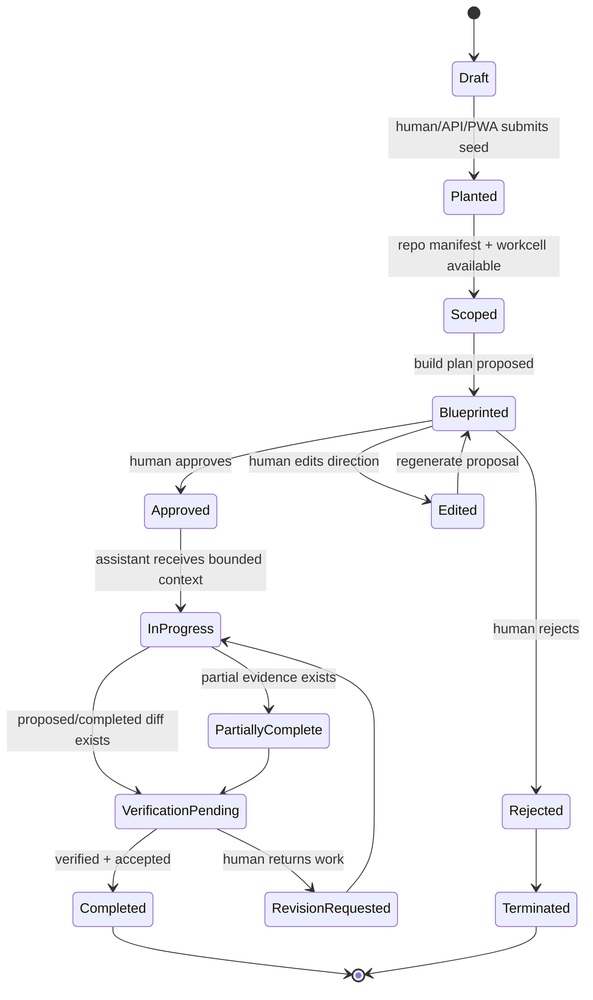
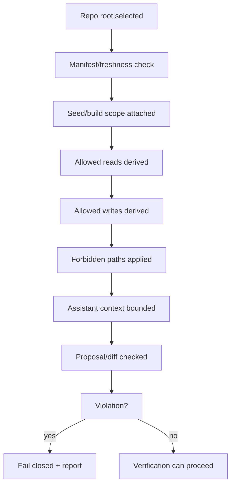
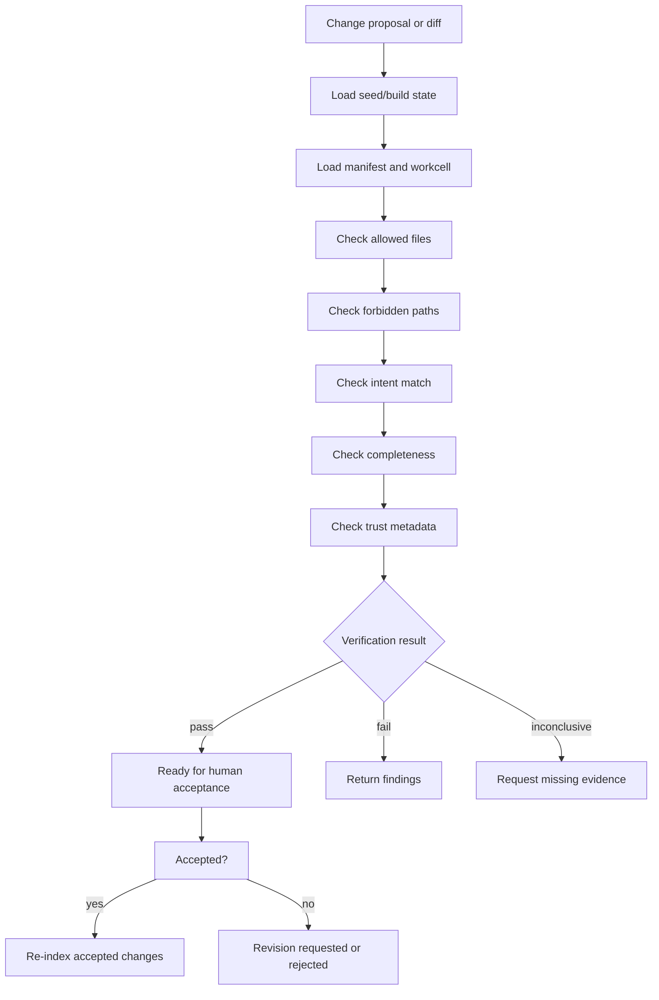

# SRT1 Runtime Flow

## Purpose

This document recovers canonical runtime behavior before implementation recovery. It defines state transitions, checkpoints, approval gates, trust transitions, and re-index events.

## Runtime Principle

SRT-1 Core observes, aligns, constrains, verifies, and preserves continuity. It does not autonomously mutate code, bypass workcells, bypass verification, or replace human approval.

## A. Seed Runtime

### Seed Checkpoints

| Checkpoint | Authority owner | Trust transition |
| --- | --- | --- |
| Seed planted | Continuity | lineage present/missing |
| Manifest attached | Repo Understanding | fresh/stale/degraded/unknown |
| Blueprint generated | Reflection + Reinjection | verified/unverified proposal |
| Human decision | Human Co-Creation | approval present/missing |
| Workcell attached | Context Isolation | boundary derived/missing |
| Verification complete | Verification | verified/unverified |
| Accepted/revision/terminated | Continuity + Human Co-Creation | completed/partial/terminated |

## B. Build Runtime

1. Seed or task enters Continuity.
2. Repo Understanding supplies current manifest and symbol/dependency facts.
3. Reflection checks current intent against doctrine and drift risks.
4. Recall supplies only relevant current history.
5. Reinjection assembles assistant-facing build context.
6. Context Isolation derives workcell boundaries.
7. Human Co-Creation reviews blueprint and approves, edits, rejects, or requests scope change.
8. Assistant works inside the approved context and boundaries.
9. Verification checks proposal/diff/evidence against seed intent and workcell.
10. Human accepts completed work or returns work for revision.
11. Repo Understanding re-indexes accepted changes.
12. Continuity records final state.

### Build States

| State | Meaning |
| --- | --- |
| Draft | Intent exists but is not ready for work. |
| Scoped | Manifest and workcell evidence are attached. |
| Blueprinted | Proposed plan exists. |
| Approved | Human gate passed. |
| In Progress | Assistant is acting with bounded context. |
| Verification Pending | Diff/proposal/evidence exists but is not accepted. |
| Accepted | Human accepted verified work. |
| Revision Requested | Human returned work with direction. |
| Terminated | Seed/build path is closed. |

## C. Workcell Runtime

### Workcell Rules

- A workcell is local containment, not Enterprise-only.
- FileCell and manifest_deriver are candidates for this authority only if decoupled from private signing, SION, private audit ledger, and Enterprise runtime.
- Workcell boundaries apply to both assistant actions and human-initiated PWA commands.
- Forbidden paths include private implementation and generated/local-only artifacts unless explicitly reviewed.

## D. Reinjection Runtime

1. Receive active seed/build context.
2. Query Recall for current state slice.
3. Query Reflection for drift/doctrine warnings.
4. Query Repo Understanding for manifest facts and symbol evidence.
5. Query Context Isolation for boundaries.
6. Assemble compact context packet.
7. Serve through approved surface: AGENTS.md, CLAUDE.md, Cursor context, MCP, local API, or context bundle.
8. Label packet with freshness/trust metadata.
9. Avoid injecting generated symbol maps into standing instruction files.

### Reinjection Checkpoints

| Checkpoint | Failure mode |
| --- | --- |
| Freshness known | stale walkthroughs enter current context |
| Scope known | assistant sees too much repo or wrong repo |
| Boundary known | unsafe paths are suggested |
| Drift warning attached | assistant repeats known architectural mistake |
| Provenance attached | context cannot be trusted or audited |

## E. Verification Runtime

### Verification Outcomes

| Outcome | Meaning |
| --- | --- |
| PASS | Evidence satisfies seed intent, workcell, and manifest checks. |
| FAIL | Evidence conflicts with intent, boundaries, or repo facts. |
| INCONCLUSIVE | Missing dependency/evidence prevents honest pass/fail. |
| REVISION REQUESTED | Human returns work with direction. |
| ACCEPTED | Human accepts verified work and triggers re-index. |

Verification prepares stitch readiness. It does not merge code and does not act as private audit signing authority.

## F. Constellation Runtime

1. Discover local SRT-1 engines or configured folders.
2. Identify each engine by repo root, port, manifest summary, and freshness state.
3. Keep each engine independent by default.
4. Request or require explicit permission for cross-module awareness.
5. Query summaries, not full context, unless approved.
6. Build constellation map.
7. Route context through Context Isolation and Reinjection.
8. Never contaminate one repo's assistant context with another repo's unapproved history.

### Constellation States

| State | Meaning |
| --- | --- |
| Unknown | Engine/folder discovered but not verified. |
| Registered | Engine identity and repo root known. |
| Fresh | Manifest summary is current. |
| Stale | Manifest summary may lag repo state. |
| Isolated | No cross-context sharing allowed. |
| Shared Summary | Approved high-level summary sharing only. |
| Coordinated | Explicit cross-module coordination active. |

## Trust Transitions

| Transition | Meaning |
| --- | --- |
| unsigned to signed | Optional external signature is present. Core can record state but does not sign privately. |
| unverified to verified | Verification evidence passed. |
| lineage missing to lineage present | Seed/build/checkpoint has provenance. |
| unknown to fresh | Repo facts and canonical docs align within threshold. |
| fresh to stale | Repo or manifest changed after context was generated. |
| stale to fresh | Re-index and canonical state update completed. |
| trusted to untrusted | Required evidence, lineage, approval, or verification is missing. |

## Re-Index Events

Re-index should occur:

1. At engine start or repo selection.
2. Before planting a seed when manifest is missing or stale.
3. After accepted changes.
4. After dependency or parser-relevant file changes.
5. Before verification when manifest freshness is unknown.
6. When constellation summaries are stale.

## Approval Gates

| Gate | Required before |
| --- | --- |
| Human approval of blueprint | Assistant receives build execution context. |
| Scope approval | Workcell expands beyond initial seed. |
| Verification evidence | Human accepts completed work. |
| Constellation permission | Cross-module context is shared. |
| Private integration availability | Optional signing/private backend state is treated as trusted. |
